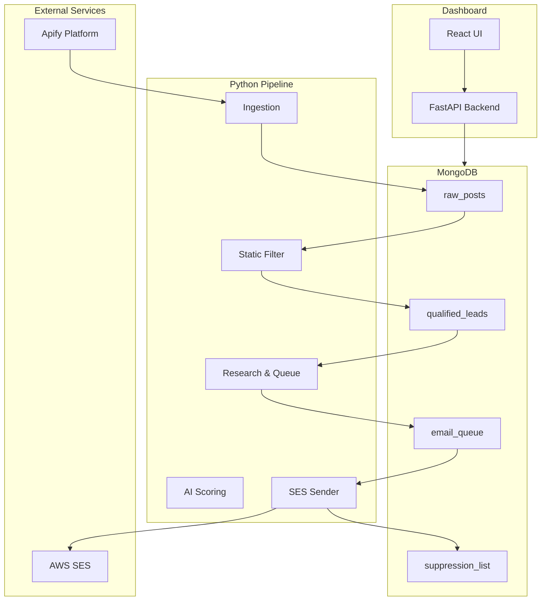
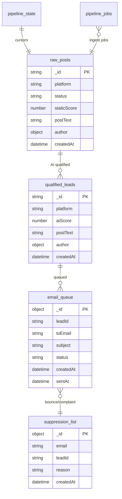

# Lead Generation System – Project Guide

A visual guide to how the project works, including the pipeline flow, dashboard features, and AWS SES integration.

---

## Table of Contents

1. [System Architecture](#1-system-architecture)
2. [Pipeline Flow](#2-pipeline-flow)
3. [Dashboard Overview](#3-dashboard-overview)
4. [Data Collections](#4-data-collections)
5. [AWS SES Integration](#5-aws-ses-integration)
6. [Quick Start](#6-quick-start)

---

## 1. System Architecture

```
┌─────────────────────────────────────────────────────────────────────────────────┐
│                         LEAD GENERATION SYSTEM                                    │
├─────────────────────────────────────────────────────────────────────────────────┤
│                                                                                  │
│   ┌──────────────────┐     ┌──────────────────┐     ┌──────────────────┐        │
│   │   Apify Actors   │     │  Python Pipeline │     │  React Dashboard  │        │
│   │  (Reddit, X/Twitter,  │  (ingestion,       │     │  (Vite + TypeScript)│      │
│   │   Instagram, etc.)    │   filter, AI, SES) │     │                  │        │
│   └────────┬─────────┘     └────────┬─────────┘     └────────┬─────────┘        │
│            │                        │                        │                   │
│            │    ┌───────────────────┴───────────────────────┐│                   │
│            └────►              MongoDB                       ││                   │
│                 │  raw_posts, qualified_leads, email_queue,  ││                   │
│                 │  suppression_list, pipeline_state, etc.   ││                   │
│                 └───────────────────┬───────────────────────┘│                   │
│                                     │                        │                   │
│                                     │    FastAPI (port 8000) │                   │
│                                     └────────────────────────┘                   │
│                                                                                  │
└─────────────────────────────────────────────────────────────────────────────────┘
```

### Mermaid: High-Level Architecture



---

## 2. Pipeline Flow

The pipeline processes leads in five sequential stages. Each stage can be run from the dashboard or via CLI.

### Flow Diagram

```
  ┌─────────────────────────────────────────────────────────────────────────────────────┐
  │                           PIPELINE STAGES                                             │
  └─────────────────────────────────────────────────────────────────────────────────────┘

  ① SCRAPE POSTS              ② STATIC FILTER           ③ AI SCORING
  ┌─────────────────┐        ┌─────────────────┐       ┌─────────────────┐
  │ Apify actors    │        │ Keyword/relevance│       │ LLM qualification│
  │ Reddit, Twitter │  ───►  │ score threshold  │ ───►  │ Intent scoring   │
  │ Instagram, etc. │        │ raw → filtered   │       │ filtered → qual  │
  └────────┬────────┘        └────────┬────────┘       └────────┬────────┘
           │                          │                         │
           ▼                          ▼                         ▼
     raw_posts                  raw_posts               qualified_leads
     (status: raw)              (status: filtered)      (status: qualified)

  ④ RESEARCH & QUEUE            ⑤ SEND EMAILS
  ┌─────────────────┐          ┌─────────────────┐
  │ Full post fetch │          │ Drain pending   │
  │ Profile enrich  │   ───►   │ queue via SES   │
  │ Contact discover│          │ Mark sent/failed│
  │ Generate email  │          │ Suppression     │
  └────────┬────────┘          └────────┬────────┘
           │                            │
           ▼                            ▼
     email_queue                 AWS SES
     (status: pending)           (delivered)
```

### Mermaid: Detailed Pipeline

```mermaid
flowchart LR
    subgraph Stage1["① Scrape"]
        A1[Apify]
        A2[raw_posts]
    end

    subgraph Stage2["② Static Filter"]
        B1[Relevance Score]
        B2[Threshold]
    end

    subgraph Stage3["③ AI Scoring"]
        C1[LLM]
        C2[qualified_leads]
    end

    subgraph Stage4["④ Research & Queue"]
        D1[Full Post]
        D2[Profile]
        D3[Contact]
        D4[email_queue]
    end

    subgraph Stage5["⑤ Send"]
        E1[SES]
        E2[sent/failed]
    end

    A1 --> A2 --> B1 --> B2 --> C1 --> C2 --> D1 --> D2 --> D3 --> D4 --> E1 --> E2
```



### Stage Summary

| Stage | Description | Input | Output |
|-------|-------------|-------|--------|
| **1. Scrape posts** | Run Apify actors per platform; normalize and store | Platforms from Settings | `raw_posts` (status: raw) |
| **2. Static filter** | Score by keywords; keep if score ≥ threshold | `raw_posts` (raw) | `raw_posts` (filtered / static_rejected) |
| **3. AI scoring** | LLM evaluates intent; qualify or reject | `raw_posts` (filtered) | `qualified_leads` |
| **4. Research & queue** | Fetch full post, profile, contact; generate email; add to queue | `qualified_leads` | `email_queue` (pending) |
| **5. Send emails** | Send pending queue via AWS SES | `email_queue` (pending) | Sent / failed; suppression |

---

## 3. Dashboard Overview

### Navigation Layout

```
┌────────────────────────────────────────────────────────────────────────────┐
│  Lead Gen Dashboard    [ Overview ] [ Pipeline ] [ Data ] [ Email ] [ Settings ]  │
├────────────────────────────────────────────────────────────────────────────┤
│                                                                             │
│  (Page content)                                                             │
│                                                                             │
└────────────────────────────────────────────────────────────────────────────┘
```

### Pages

#### Overview (`/`)

High-level KPIs and charts.

```
┌─────────────────────────────────────────────────────────────────────────────┐
│  Overview                                                      [Open Pipeline] │
├─────────────────────────────────────────────────────────────────────────────┤
│                                                                              │
│  At a glance                                                                 │
│  ┌──────────┐ ┌──────────┐ ┌──────────┐ ┌──────────┐ ┌──────────┐ ┌────────┐│
│  │Raw posts │ │Qualified │ │ Pending  │ │  Sent    │ │Suppress. │ │Seen    ││
│  │   142    │ │   28     │ │   12     │ │   89     │ │   5      │ │ hashes ││
│  └──────────┘ └──────────┘ └──────────┘ └──────────┘ └──────────┘ └────────┘│
│                                                                              │
│  Posts by platform          Raw posts by status         Qualified by platform│
│  ┌──────────────────────┐   ┌──────────────────────┐   ┌──────────────────────┐
│  │ █ Reddit    45       │   │  [Pie: raw, filtered,│   │ █ Reddit    12       │
│  │ █ Twitter   38       │   │   qualified, etc.]   │   │ █ Twitter   8        │
│  │ █ Instagram 32       │   │                      │   │ █ Instagram 5        │
│  └──────────────────────┘   └──────────────────────┘   └──────────────────────┘
│                                                                              │
│  Pipeline funnel            Job history                                      │
│  Scraped → Passed static → AI qualified → In queue → Sent                    │
│                                                                              │
└─────────────────────────────────────────────────────────────────────────────┘
```

#### Pipeline (`/pipeline`)

Run each stage and view job history.

```
┌─────────────────────────────────────────────────────────────────────────────┐
│  Pipeline                                                                     │
├─────────────────────────────────────────────────────────────────────────────┤
│  Stages                                                                       │
│  ┌────────────────────────┐  ┌────────────────────────┐                      │
│  │ ① Scrape posts         │  │ ② Static filter        │                      │
│  │ [Run]                  │  │ [Run]                  │                      │
│  └────────────────────────┘  └────────────────────────┘                      │
│  ┌────────────────────────┐  ┌────────────────────────┐                      │
│  │ ③ AI scoring           │  │ ④ Research & queue     │                      │
│  │ [Run]                  │  │ [Run]                  │                      │
│  └────────────────────────┘  └────────────────────────┘                      │
│  ┌────────────────────────┐                                                   │
│  │ ⑤ Send emails          │                                                   │
│  │ [Run]                  │                                                   │
│  └────────────────────────┘                                                   │
│                                                                               │
│  Job history                                                                  │
│  Stage           Status    Started      Duration   Action                     │
│  Scrape posts    completed 2:30 PM      1m 23s     —                          │
│  Static filter   completed 2:32 PM      4s         —                          │
│  AI scoring      running   2:32 PM      —          [Cancel]                   │
└─────────────────────────────────────────────────────────────────────────────┘
```

#### Data (`/data`)

Browse raw posts, qualified leads, email queue, and suppression list with filters and pagination.

```
┌─────────────────────────────────────────────────────────────────────────────┐
│  Data                                                                         │
├─────────────────────────────────────────────────────────────────────────────┤
│  [ Raw posts ] [ Qualified leads ] [ Email queue ] [ Suppression ]            │
│                                                                               │
│  Filters: [All statuses ▼] [All platforms ▼]              Page 1 of 5        │
│  ┌─────────────────────────────────────────────────────────────────────────┐ │
│  │ Platform  │ Status   │ Post preview          │ Author   │ Link          │ │
│  │ Reddit    │ filtered │ "Looking for a dev..."│ john_doe │ Open          │ │
│  │ Twitter   │ raw      │ "Anyone know a..."    │ @jane    │ Open          │ │
│  └─────────────────────────────────────────────────────────────────────────┘ │
└─────────────────────────────────────────────────────────────────────────────┘
```

#### Email (`/email`)

Control sending and manage the queue.

```
┌─────────────────────────────────────────────────────────────────────────────┐
│  Email                                                                        │
├─────────────────────────────────────────────────────────────────────────────┤
│  Queue summary                                                                │
│  Pending: 12    Sent: 89    Failed: 3         [Pie: Pending / Sent / Failed]  │
│                                                                               │
│  Sending: [Pause sending] [Resume sending]                                    │
│                                                                               │
│  Pending queue                                                                │
│  To                    Subject                           Action               │
│  lead@example.com      Quick question about your project [Cancel]             │
└─────────────────────────────────────────────────────────────────────────────┘
```

#### Settings (`/settings`)

Configure scraping and sending.

```
┌─────────────────────────────────────────────────────────────────────────────┐
│  Settings                                                                     │
├─────────────────────────────────────────────────────────────────────────────┤
│  Scraping platforms                                                           │
│  [x] Reddit  [x] Twitter  [x] Instagram  [x] Facebook  [x] LinkedIn           │
│  [All on] [All off]                                                           │
│                                                                               │
│  Sending                                                                      │
│  Pause sending:  [Off] [Paused]                                               │
│  Delay between emails (ms): [30000    ]                                       │
│  Send batch size:           [20       ]                                       │
└─────────────────────────────────────────────────────────────────────────────┘
```

---

## 4. Data Collections



| Collection | Purpose |
|------------|---------|
| `raw_posts` | All scraped posts; status: raw, filtered, qualified, static_rejected, ai_rejected |
| `qualified_leads` | AI-qualified leads ready for email |
| `email_queue` | Pending/sent/failed email jobs |
| `suppression_list` | Bounces, complaints, unsubscribes (never email again) |
| `pipeline_state` | Ingestion cursors, last run time |
| `pipeline_jobs` | Job history for dashboard |
| `seen_post_hashes` | Deduplication of scraped posts |

---

## 5. AWS SES Integration

### SES Flow

```
┌─────────────────────────────────────────────────────────────────────────────────┐
│  AWS SES Integration                                                              │
├─────────────────────────────────────────────────────────────────────────────────┤
│                                                                                  │
│  email_queue (status=pending)                                                    │
│         │                                                                        │
│         ▼                                                                        │
│  ┌─────────────────────────────────────────────────────────────────────────┐    │
│  │  ses_sender.send_queued_emails()                                         │    │
│  │  • Check app_config: sending_paused, send_delay_ms, send_batch_size      │    │
│  │  • Enforce SES_DAILY_CAP                                                 │    │
│  │  • Skip suppressed emails                                                │    │
│  │  • Build MIME (List-Unsubscribe, Reply-To, Message-ID, X-Mailer)         │    │
│  │  • boto3 SES send_raw_email                                              │    │
│  │  • Retry on transient errors; add permanent bounces to suppression       │    │
│  └─────────────────────────────────────────────────────────────────────────┘    │
│         │                                                                        │
│         ▼                                                                        │
│  status=sent (sentAt)   or   status=failed (error)                               │
│                                                                                  │
└─────────────────────────────────────────────────────────────────────────────────┘
```

### Sandbox vs Production

| Mode | Behavior |
|------|----------|
| **Sandbox** | SES accepts only verified sender and recipient addresses. Emails to unverified recipients fail with `MessageRejected`. |
| **Production** | SES can send to any address within sending limits. |

While in sandbox, you can test by verifying your own addresses in the SES console. Once production access is granted, the same code will work with your configured `SES_FROM_EMAIL` and any recipients.

### Required Environment Variables

| Variable | Purpose |
|----------|---------|
| `AWS_ACCESS_KEY_ID` | IAM user for SES |
| `AWS_SECRET_ACCESS_KEY` | IAM secret |
| `AWS_REGION` | SES region (e.g. `us-east-1`) |
| `SES_FROM_EMAIL` | Verified sender address |
| `SES_DAILY_CAP` | Max emails per day (default 100) |

Optional: `SES_REPLY_TO_EMAIL`, `UNSUBSCRIBE_MAILTO`, `UNSUBSCRIBE_URL` for deliverability.

---

## 6. Quick Start

### Run Locally

```bash
# 1. Start MongoDB (and Redis if used)
docker-compose up -d mongo redis

# 2. Copy and fill .env
cp .env.example .env
# Edit .env: APIFY_TOKEN, GOOGLE1/2/3, AWS creds, SES_FROM_EMAIL

# 3. Start API (FastAPI)
cd services/api
pip install -r requirements.txt
uvicorn main:app --reload --host 0.0.0.0 --port 8000

# 4. Start Dashboard (React)
cd services/dashboard
npm install
npm run dev
# Open http://localhost:3000 (proxies /api to :8000)

# 5. Run pipeline (CLI)
python -m pipeline.run_pipeline
# Or: --ingest-only, --filter-only, --ai-only, --send-only, --dry-run
```

### Production Checklist

- [ ] MongoDB accessible (Atlas or hosted)
- [ ] AWS SES in production mode
- [ ] `UNSUBSCRIBE_MAILTO` or `UNSUBSCRIBE_URL` set for deliverability
- [ ] CORS restricted in API for production domains
- [ ] Reverse proxy (e.g. nginx) to serve API + dashboard under same origin

---

*Generated for the Lead Generation project. For questions, see the codebase or README.*
